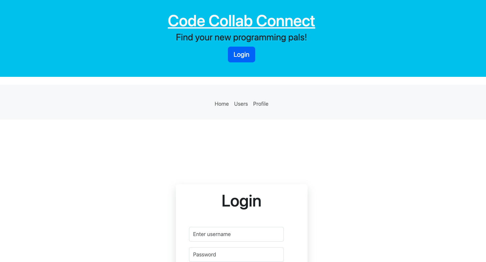
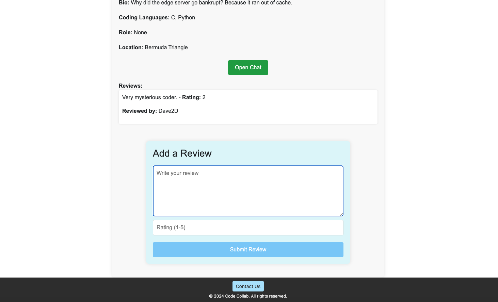
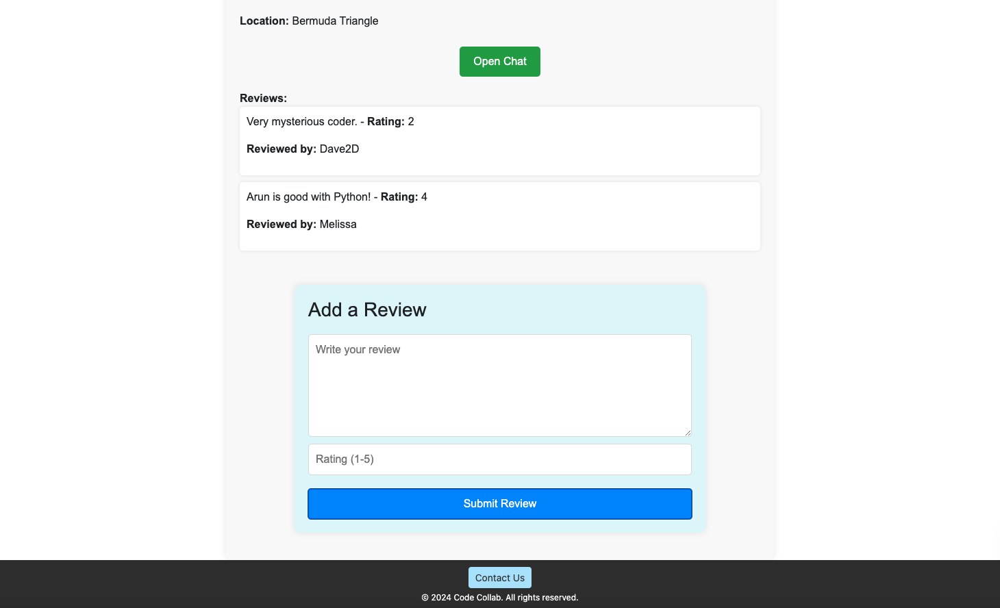

# Code-Collab
- A website for individuals who code to collobrate! 

## Table of Contents 
- [Code-Collab](#code-collab)
  - [Table of Contents](#table-of-contents)
  - [Description](#description)
  - [User Story](#user-story)
  - [Acceptance Criteria](#acceptance-criteria)
  - [Technologies Used](#technologies-used)
  - [Installation](#installation)
  - [Usage](#usage)
  - [Screenshots](#screenshots)
  - [Live Link](#live-link)
  - [License](#license)
  - [Credits](#credits)

## Description
- Our motivation for this project was launched after a discussion about connecting with each other, and our classmates, after our boot camp has ended. We aimed to build an application where developers could connect and further build on their skills. We also wanted to provide a welcoming space for developers of all levels to collobrate and the classification for developers as either a mentor, collobrator or study buddy, was introduced. 
- Some challenges were initially faced when beginning to code and organizing the layout of the website to create a user friendly and cohesive application, which affected how we moved forward with our code. 
- There were also challenges with updating a profile and saving the user's previously added profile data. The update was clearing all the user's data at first and a useEffect hook was implemented in order to retrieve the user data previously input. 
- As well, implementing a filtering system in order to filter users by their role caused challenges. 
- Initially implementing the review system was difficult and we decided users should be able to interact with each other before they could review each user. The message system was then implemented, even though it had not initially been part of our MVP.
- Future development will include further work on front-end styling and possibly implementing another styling library, such as Material UI.   
- We would like to implement a message box for questions, similar to an AI chatbox, and a payment stripe. With a payment option, we hope to add some type of payment for users, such as a tip system and/or for uesrs who want to provide services for a fee, for example mentoring. 
- We would like to show the connection history between users so that users can see who they have previously interacted with.
- Since filtering users by their role was also a challenge to implement by the project deadline this will be a future development task.
- We would like to only allow users who have interacted and previously connected to leave a review of that user. As well, so that users cannot leave themselves a review.
- Lastly, we would like to allow users to upload a photo, rather than having this piece hardcoded, and we would implement a technology, such as Multer or Cloudinary. 
- We learned a lot during the making of this project, including a much better understanding of React, specifically, components, useEffect hooks and styling. This project also helped us understand working with MongoDB and Atlas and a cloud-based server. As well, this project really brought all the concepts of this bootcamp together to provide a much clearer understanding of web development. 

## User Story 
 
AS a software developer
I WANT to find a website with like-minded individuals 
SO THAT I can collobrate with other developers and either build on or showcase my skill set

## Acceptance Criteria
  
GIVEN a website for web developers
WHEN I go to the website
THEN I am presented with a page prompting a login or signup
WHEN I am logged in 
THEN I am presented with all the users of the website
WHEN I go to my profile 
THEN I am given the option to update my profile or delete my profile
WHEN I go to another user's profile
THEN I am given an option to open a chat or review the user

## Technologies Used 
- React
- React Bootstrap v2.10.2 (Bootstrap 5)
- Bcrypt 5.1.1
- JWT Web Token 9.0.2
- Express 4.19.2
- MongoDB 6.7.0
- Mongoose 8.4.1
- Nodemon 3.0.1
- Socket.io 4.7.5
- Bcrypt 5.1.1
- cors 2.8.5
- Dotenv 16.4.5
- Mdb-react-ui-kit 
- @fortawesome/react-fontawesome @fortawesome/free-solid-svg-icons react-modal
- React-modal
- React-router-dom
- Axios

## Installation
- Initialize Project: Run npm run install command in the terminal to install all dependencies.
- Start Development Server: Run npm run develop command in the terminal to start the application.

## Usage
- To utilize this webpage a user can access the deployed link. As well, a user can git clone the application to their local computer and install the required dependencies listed above in the terminal. 

## Screenshots

## Live Link
[x][y]

## License
- An MIT License was used for this project. Please refer to the license documentation in the project for more detailed information. 

## Credits 

Brown, J. (2023, August 16). Git Branching and Merging: A Step-By-Step Guide. Varonis. https://www.varonis.com/blog/git-branching

Configure Database Users. (n.d.). MongoDB. https://www.mongodb.com/docs/atlas/security-add-mongodb-users/

FredAbod [username]. (2024, February 15). Dev. https://dev.to/fredabod/authentication-signup-and-login-with-expressmongodb-and-jwt-2n64

Hanlon, R. (2022, March 8). How to Upgrade to React 18. React. 
https://react.dev/blog/2022/03/08/react-18-upgrade-guide#updates-to-client-rendering-apis

Formspree. (2024). Formspree. https://formspree.io/

Laith Harb [Username]. (2022, January 14). React Router v6 Tutorial [Video]. YouTube. Retrieved from https://www.youtube.com/watch?v=rxzOqP9YwmM&list=PL-RBOWPzYiMdR3xRSR2mOF8X0G8gWYkSe

How to Use MERN Stack: A Complete Guide. (n.d.). MongoDB. https://www.mongodb.com/resources/languages/mern-stack-tutorial

HTML Select Tag. (n.d.). W3Schools. https://www.w3schools.com/tags/tag_select.asp

MongoDB [Username]. (2024, March 8). The Ultimate MERN Stack Complete Guide (MongoDB, Express, React, Node.js) [Video]. YouTube. https://www.youtube.com/watch?v=4nKWREmCvsE&list=PL-RBOWPzYiMdR3xRSR2mOF8X0G8gWYkSe&index=2

MongoDB. (n.d.). MERN Stack Tutorial. Retrieved from https://www.mongodb.com/resources/languages/mern-stack-tutorial

MongoDB. (n.d.). Security: Add MongoDB Users. Retrieved from https://www.mongodb.com/docs/atlas/security-add-mongodb-users/

Outlet. (n.d.). React Route. https://reactrouter.com/en/main/components/outlet

Protected Routes in React Router. (2024, April 4). Angular Mindshttps://www.angularminds.com/blog/protected-routes-in-react-router-authentication-and-authorization

React. (2022, March 8). React 18 Upgrade Guide. Retrieved from https://react.dev/blog/2022/03/08/react-18-upgrade-guide#updates-to-client-rendering-apis

React. (n.d.). Switch to CreateRoot. Retrieved from https://reactjs.org/link/switch-to-createroot

React: Outlet, Params. (2023, April 12). Medium. https://medium.com/@hpark0114/react-outlet-params-5da45901fc45

React Templates. (n.d.). Material UI. https://mui.com/material-ui/getting-started/templates/

React v18.0. (2022, March 29). React. https://legacy.reactjs.org/blog/2022/03/29/react-v18.html

sebastienlorber [Username]. (n.d.). How Should a Protected Route Be Created with React Route v6.4? [Online forum]. Reddit. https://www.reddit.com/r/reactjs/comments/16zojkf/how_should_a_protected_route_be_created_with/

Sharma, A. (n.d.). NodeJS and MongoDB Application Authentication by JWT. Login Radius. https://www.loginradius.com/blog/engineering/nodejs-and-mongodb-application-authentication-by-jwt/

Socket.IO. (n.d.). Socket.IO Documentation. Retrieved from https://socket.io/

SourabhBagrecha [Username]. (2022, July). Argument of type ‘{ useNewUrlParser: boolean; useUnifiedTopology: boolean}’ is not assignable to parameter of type' [Online forum]. MongoDB Developer Community. https://www.mongodb.com/community/forums/t/argument-of-type-usenewurlparser-boolean-useunifiedtopology-boolean-is-not-assignable-to-parameter-of-type/169033/3

Stacklep1 [Username]. (2021, March 25). React-router-dom' does not contain an export named useHistory [Online forum post]. Stack Overflow. https://stackoverflow.com/questions/66794972/react-router-dom-does-not-contain-an-export-named-usehistory

Stack Overflow. (2021, March 31). React-router-dom does not contain an export named 'useHistory'. Retrieved from https://stackoverflow.com/questions/66794972/react-router-dom-does-not-contain-an-export-named-usehistory

TheIvoryCoder [Username]. (2022, August 4). How To Use Material UI With React - Quick Tutorial [Video]. YouTube. https://www.youtube.com/watch?v=Mzk0x5687YM

University of Toronto. (2023). Coding Boot Camp [Source Code].

Using the Effect Hook. (n.d.). React https://legacy.reactjs.org/docs/hooks-effect.html
